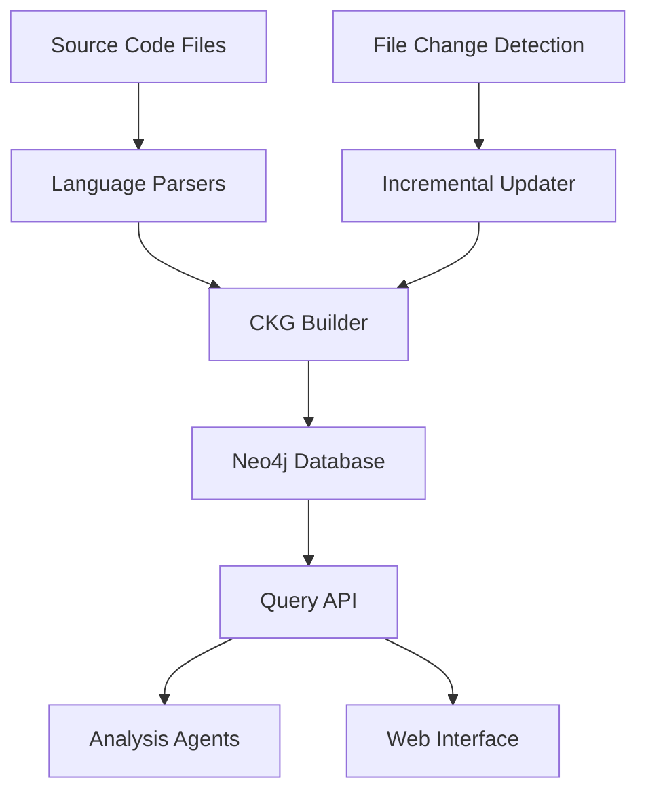

# Code Knowledge Graph (CKG) System

## Overview

The Code Knowledge Graph (CKG) system is the heart of NovaGuard's code analysis capabilities. It creates a rich, semantic representation of code structure and relationships using Neo4j as the graph database. This enables sophisticated code analysis, dependency tracking, impact analysis, and intelligent code review capabilities.

## Architecture



## Key Components

### 1. Language Parsers (`parsers/`)

- **BaseCodeParser**: Abstract base class for all language parsers
- **PythonParser**: Complete Python language support with AST parsing
- **JavaScriptParser**: JavaScript/TypeScript support for modern web development
- **Future**: Java, Go, C++, Rust, and other language parsers

**Features:**
- Tree-sitter based parsing for accuracy and performance
- Extract classes, functions, variables, imports, and relationships
- Handle language-specific constructs (decorators, type annotations, etc.)
- Robust error handling and recovery

### 2. CKG Builder (`builder.py`)

Responsible for building and maintaining the knowledge graph:

- **Project Management**: Create and update project nodes
- **Entity Extraction**: Process parsed code into graph entities
- **Relationship Building**: Create semantic relationships between entities
- **Batch Processing**: Efficient bulk operations for large codebases
- **Error Recovery**: Graceful handling of parsing errors

### 3. Query API (`query_api.py`)

High-level interface for querying the knowledge graph:

- **Project Overview**: Get statistics and summaries
- **Function Analysis**: Call graphs, complexity metrics, impact analysis
- **Class Hierarchy**: Inheritance relationships and class structure
- **Dependency Analysis**: Import relationships and circular dependencies
- **Search and Discovery**: Find entities by name or type
- **Impact Analysis**: Determine effects of code changes

### 4. Incremental Updater (`incremental_updater.py`)

Efficient updates for large codebases:

- **Change Detection**: Content-based file change detection using hashes
- **Impact Analysis**: Determine which files need updating based on dependencies
- **Selective Updates**: Update only changed files and their dependents
- **Validation**: Ensure graph consistency after updates

### 5. Enhanced Schema (`enhanced_neo4j_schema.cypher`)

Extended node types and relationships:

- **New Node Types**: Interface, Enum, Constant, APIEndpoint, DatabaseTable, ConfigurationFile
- **Enhanced Relationships**: IMPLEMENTS, DEPENDS_ON, EXPOSES_API, ACCESSES_DB
- **Metadata Support**: Code metrics, documentation, type annotations
- **Performance Optimization**: Comprehensive indexing strategy

## Quick Start

### 1. Basic CKG Building

```python
from app.ckg_builder.builder import CKGBuilder
from app.models import Project

# Create CKG for a project
project = Project.query.get(project_id)
builder = CKGBuilder(project)

# Build from local repository
await builder.build_for_project_from_path("/path/to/repo")
```

### 2. Incremental Updates

```python
from app.ckg_builder.incremental_updater import IncrementalCKGUpdater

# Initialize updater
updater = IncrementalCKGUpdater(project)

# Update specific files
changed_files = {
    "src/main.py": "# updated file content",
    "src/utils.py": "# another updated file"
}

# Perform incremental update
stats = await updater.update_incremental(changed_files)
print(f"Updated {stats['processed_files']} files")
```

### 3. Querying the Graph

```python
from app.ckg_builder.query_api import CKGQueryAPI

# Initialize query API
query_api = CKGQueryAPI()
project_graph_id = f"novaguard_project_{project.id}"

# Get project overview
overview = await query_api.get_project_overview(project_graph_id)
print(f"Project has {overview['function_count']} functions")

# Find function call relationships
calls = await query_api.get_function_calls(project_graph_id, "process_data")
for call in calls:
    print(f"{call.caller_name} calls {call.callee_name} at line {call.call_line}")

# Find circular dependencies
cycles = await query_api.find_circular_function_calls(project_graph_id)
for cycle in cycles:
    print(f"Circular dependency: {' -> '.join(cycle)}")
```

## Advanced Usage

### Custom Language Parser

```python
from app.ckg_builder.parsers import BaseCodeParser, ParsedFileResult

class GoParser(BaseCodeParser):
    def __init__(self):
        super().__init__("go")
        # Initialize Go-specific queries
        
    def _extract_entities(self, root_node, result):
        # Implement Go-specific entity extraction
        pass

# Register the parser
def get_go_parser():
    return GoParser()
```

### Custom Analysis Queries

```python
# Find functions with high complexity
complexity_metrics = await query_api.get_function_complexity_metrics(project_graph_id)
high_complexity = [f for f in complexity_metrics if f['total_coupling'] > 10]

# Find large classes (potential God classes)
large_classes = await query_api.find_large_classes(project_graph_id, min_methods=20)

# Search for specific patterns
entities = await query_api.search_entities(
    project_graph_id, 
    "user", 
    entity_types=["Function", "Class"]
)
```

### Impact Analysis for Code Changes

```python
# Analyze impact before making changes
impact = await updater.get_update_impact_analysis(["src/models/user.py"])
print(f"Will affect {impact['affected_function_count']} functions")
print(f"Will update {impact['total_files_to_update']} files")

# Validate graph consistency after updates
validation = await updater.validate_graph_consistency()
if not validation['is_valid']:
    print(f"Issues found: {validation['issues']}")
```

## Configuration

### Environment Variables

```bash
# Neo4j Configuration
NEO4J_URI=bolt://localhost:7687
NEO4J_USERNAME=neo4j
NEO4J_PASSWORD=password
NEO4J_DATABASE=novaguard

# CKG Settings
CKG_BATCH_SIZE=100
CKG_MAX_FILE_SIZE=1048576  # 1MB
CKG_ENABLE_INCREMENTAL=true
```

### Parser Configuration

```python
# Configure parser behavior
PARSER_CONFIG = {
    "python": {
        "extract_docstrings": True,
        "extract_type_hints": True,
        "extract_decorators": True
    },
    "javascript": {
        "extract_jsdoc": True,
        "extract_typescript_types": True,
        "extract_exports": True
    }
}
```

## Performance Optimization

### Indexing Strategy

The enhanced schema includes comprehensive indexing for optimal query performance:

```cypher
// File content hash for change detection
CREATE INDEX file_content_hash_idx FOR (f:File) ON (f.content_hash);

// Function complexity queries
CREATE INDEX function_complexity_idx FOR (fn:Function) ON (fn.cyclomatic_complexity);

// Class size queries
CREATE INDEX class_method_count_idx FOR (c:Class) ON (c.method_count);
```

### Batch Processing

For large codebases:

```python
# Process files in batches
BATCH_SIZE = 50
files = list(file_paths)
for i in range(0, len(files), BATCH_SIZE):
    batch = files[i:i + BATCH_SIZE]
    await builder.process_file_batch(batch)
```

### Memory Management

```python
# Configure memory limits
builder.set_memory_limit(512 * 1024 * 1024)  # 512MB
builder.enable_streaming_mode(True)
```

## Testing

### Unit Tests

```bash
# Run CKG-specific tests
pytest tests/ckg_builder/ -v

# Run with coverage
pytest tests/ckg_builder/ --cov=app.ckg_builder --cov-report=html
```

### Integration Tests

```bash
# Test with real repositories
pytest tests/integration/test_ckg_integration.py
```

### Performance Tests

```bash
# Benchmark parsing performance
python tests/performance/benchmark_parsers.py

# Test large repository handling
python tests/performance/test_large_repo.py
```

## Monitoring and Debugging

### Logging Configuration

```python
import logging

# Enable detailed CKG logging
logging.getLogger('app.ckg_builder').setLevel(logging.DEBUG)

# Monitor Neo4j queries
logging.getLogger('neo4j').setLevel(logging.INFO)
```

### Health Checks

```python
# Check CKG system health
health = await query_api.get_system_health()
print(f"Node count: {health['node_count']}")
print(f"Relationship count: {health['relationship_count']}")
print(f"Index status: {health['index_status']}")
```

### Debugging Tools

```python
# Visualize query execution plans
explain_result = await query_api.explain_query(
    "MATCH (f:Function)-[:CALLS]->(g:Function) RETURN count(*)"
)

# Profile query performance
profile_result = await query_api.profile_query(complex_query)
```

## Troubleshooting

### Common Issues

1. **Memory Issues with Large Files**
   ```python
   # Solution: Enable streaming and set file size limits
   builder.set_max_file_size(1024 * 1024)  # 1MB limit
   builder.enable_streaming_mode(True)
   ```

2. **Neo4j Connection Issues**
   ```python
   # Solution: Check connection and retry
   try:
       await builder.test_connection()
   except ConnectionError:
       await asyncio.sleep(5)
       await builder.retry_connection()
   ```

3. **Parser Errors**
   ```python
   # Solution: Enable error recovery
   parser.set_error_recovery(True)
   parser.set_max_errors(10)
   ```

### Performance Issues

1. **Slow Queries**
   - Check if appropriate indexes exist
   - Use EXPLAIN to analyze query plans
   - Consider query optimization

2. **Memory Usage**
   - Monitor heap usage during batch processing
   - Implement pagination for large result sets
   - Use streaming for file processing

## Contributing

### Adding New Language Support

1. Create parser class extending `BaseCodeParser`
2. Implement language-specific query definitions
3. Add entity extraction logic
4. Create comprehensive test suite
5. Update language detection in `get_code_parser()`

### Extending Node Types

1. Add new constraints to enhanced schema
2. Update CKG builder to create new node types
3. Add query methods to Query API
4. Update documentation and tests

### Performance Improvements

1. Profile existing code for bottlenecks
2. Implement caching for frequently accessed data
3. Optimize Neo4j queries and indexing
4. Add batch processing optimizations

## Roadmap

### Near Term (Q1 2024)
- [ ] Java parser implementation
- [ ] Enhanced TypeScript support (interfaces, generics)
- [ ] Code metrics calculation and storage
- [ ] Real-time incremental updates via file watchers

### Medium Term (Q2-Q3 2024)
- [ ] Go and Rust parser support
- [ ] API endpoint detection and tracking
- [ ] Database schema analysis integration
- [ ] Configuration file parsing and tracking
- [ ] Machine learning for code pattern detection

### Long Term (Q4 2024+)
- [ ] Multi-repository dependency tracking
- [ ] Cross-language call graph analysis
- [ ] Automated architecture diagram generation
- [ ] Code clone detection
- [ ] Technical debt analysis and recommendations

## API Reference

See the [API Reference](./API_REFERENCE.md) for detailed documentation of all classes and methods.

## Examples

See the [Examples](./examples/) directory for complete working examples and use cases. 